# PDF to Markdown Converter Backend

A FastAPI-based backend service that converts PDF documents to Markdown format using MarkItDown and cleans the content using an integrated vLLM deployment.

## Features

- 📄 PDF to Markdown conversion using MarkItDown
- 🤖 **Integrated vLLM service** with automatic startup/management
- 🚀 Fast and async processing
- 🐳 Docker support with GPU acceleration
- 📊 Health checks and monitoring
- 🔒 File validation and security
- 📖 Comprehensive API documentation
- ⚙️ **vLLM management endpoints** for control and monitoring
- 🌊 **Token-by-token streaming** for real-time response (like ChatGPT!)

## 🌊 Streaming Support

Experience real-time token-by-token streaming from vLLM, just like ChatGPT! This provides immediate feedback and better user experience for long documents.

### Streaming Endpoints

- **`POST /clean-markdown-stream`** - Stream cleaned markdown token by token
- **`POST /upload-stream`** - Upload PDF and stream cleaned markdown in real-time

### Benefits of Streaming

- ⚡ **Immediate feedback** - See tokens as they're generated
- 🎯 **Better UX** - No waiting for complete response
- 📈 **Progress indication** - Users see processing happening
- 🔄 **Interactive experience** - Like modern AI chatbots

### Demo

Open `streaming_demo.html` in your browser to see streaming in action:

```bash
# Start the backend
python main.py

# Open the demo (make sure backend is running on localhost:8001)
open streaming_demo.html
```

### Usage Examples

**Python Streaming Client:**
```python
import httpx

async with httpx.AsyncClient() as client:
    payload = {"markdown_content": "# Test\n\nContent to clean..."}
    async with client.stream("POST", "/clean-markdown-stream", json=payload) as response:
        async for chunk in response.aiter_text():
            print(chunk, end="", flush=True)  # Real-time output!
```

**cURL with Streaming:**
```bash
curl -X POST "http://localhost:8001/clean-markdown-stream" \
  -H "Content-Type: application/json" \
  -d '{"markdown_content": "# Test\n\nContent..."}' \
  --no-buffer
```

## Quick Start

### Prerequisites

- Python 3.11+
- CUDA-compatible GPU (recommended, but CPU mode supported)
- 8GB+ RAM (more for larger models)

### Installation

1. Clone the repository:
```bash
git clone <repository-url>
cd backend
```

2. Install dependencies:
```bash
pip install -r requirements.txt
```

3. Start the server:
```bash
python main.py
```

The backend will automatically start the vLLM service if `VLLM_AUTO_START=true` (default).

Or use the startup script:
```bash
./start.sh
```

### Docker with GPU Support

Build and run with Docker (GPU support):
```bash
docker build -t pdf2md-backend .
docker run --gpus all -p 8001:8001 -p 8000:8000 pdf2md-backend
```

For CPU-only mode:
```bash
docker run -p 8001:8001 -p 8000:8000 pdf2md-backend
```

## Configuration

Configure the service using environment variables:

| Variable | Default | Description |
|----------|---------|-------------|
| `HOST` | `0.0.0.0` | Server host |
| `PORT` | `8001` | Server port |
| `VLLM_BASE_URL` | `http://localhost:8000` | vLLM service URL |
| `VLLM_MODEL_NAME` | `mistralai/Mistral-7B-Instruct-v0.3` | Model name |
| `VLLM_AUTO_START` | `true` | Auto-start vLLM service |
| `VLLM_STARTUP_TIMEOUT` | `300` | vLLM startup timeout (seconds) |
| `VLLM_GPU_MEMORY_UTILIZATION` | `0.8` | GPU memory usage (0.0-1.0) |
| `VLLM_MAX_MODEL_LEN` | `4096` | Maximum model context length |
| `MAX_FILE_SIZE_MB` | `50` | Maximum file size |
| `MODEL_CACHE_DIR` | `./models` | Model cache directory |
| `LOG_LEVEL` | `INFO` | Logging level |

## API Endpoints

### Health Check

```http
GET /health
```

Returns the health status of the API and vLLM service.

**Response:**
```json
{
  "api": "healthy",
  "vllm": "healthy",
  "vllm_process": {
    "process_running": true,
    "process_pid": 12345,
    "port": 8000,
    "model": "mistralai/Mistral-7B-Instruct-v0.3",
    "memory_usage_mb": 2048.5,
    "gpu_available": true
  }
}
```

### vLLM Management

#### Get vLLM Status
```http
GET /vllm/status
```

#### Start vLLM Service
```http
POST /vllm/start
Content-Type: application/json

{
  "model_name": "mistralai/Mistral-7B-Instruct-v0.3"  // optional
}
```

#### Stop vLLM Service
```http
POST /vllm/stop
```

#### Restart vLLM Service
```http
POST /vllm/restart
Content-Type: application/json

{
  "model_name": "mistralai/Mistral-7B-Instruct-v0.3"  // optional
}
```

### Upload PDF

```http
POST /upload
```

Upload a PDF file and convert it to Markdown.

**Parameters:**
- `file` (form-data): PDF file to upload
- `clean_with_llm` (query, optional): Whether to clean with vLLM (default: true)

**Response:**
```json
{
  "success": true,
  "filename": "document.pdf",
  "raw_markdown": "# Document\n\nContent...",
  "cleaned_markdown": "# Document\n\nCleaned content...",
  "cleaned_with_llm": true,
  "content_length": 1234,
  "metadata": {
    "original_filename": "document.pdf",
    "file_size_bytes": 102400,
    "conversion_method": "MarkItDown",
    "llm_cleaning": true
  }
}
```

### Convert Text Only

```http
POST /convert-text
```

Convert PDF to Markdown without LLM cleaning (faster).

**Parameters:**
- `file` (form-data): PDF file to upload

### Clean Markdown

```http
POST /clean-markdown
```

Clean existing Markdown content using vLLM.

**Request Body:**
```json
{
  "markdown_content": "# Document\n\nContent with errors..."
}
```

**Response:**
```json
{
  "success": true,
  "original_content": "# Document\n\nContent with errors...",
  "cleaned_content": "# Document\n\nCleaned content...",
  "content_length": 1234
}
```

## API Documentation

Once the server is running, visit:
- Swagger UI: `http://localhost:8001/docs`
- ReDoc: `http://localhost:8001/redoc`

## Testing

The project uses **pytest** for professional testing with comprehensive coverage of all API endpoints and functionality.

### Test Structure

```
tests/
├── __init__.py              # Test package
├── conftest.py             # Pytest fixtures and configuration
├── test_health.py          # Health check tests
├── test_pdf_conversion.py  # PDF conversion tests
├── test_markdown_cleaning.py # Markdown cleaning tests
└── test_vllm_management.py # vLLM management tests
```

### Quick Start

1. **Install test dependencies**:
```bash
pip install -r test_requirements.txt
```

2. **Run all tests**:
```bash
pytest
```

3. **Run with coverage**:
```bash
pytest --cov=. --cov-report=html
```

### Test Commands

```bash
# Run specific test files
pytest tests/test_health.py
pytest tests/test_pdf_conversion.py

# Run with different verbosity levels
pytest -v                    # Verbose
pytest -v -s                 # Verbose with output capture disabled

# Run tests in parallel
pytest -n auto

# Generate HTML report
pytest --html=report.html --self-contained-html

# Show slowest tests
pytest --durations=10

# Run only fast tests (skip slow ones)
pytest -m "not slow"
```

### Test Configuration

Tests are configured via `pytest.ini` with:
- **Async Support**: Automatic async/await test detection
- **Fixtures**: Reusable HTTP client and sample data
- **Performance**: Response time validation and timing
- **Error Handling**: Tests for both success and failure scenarios
- **Integration**: End-to-end API testing

### Sample Test Output

```bash
$ pytest -v
========================= test session starts =========================
tests/test_health.py::test_health_check PASSED           [ 12%]
tests/test_health.py::test_vllm_status PASSED            [ 25%]
tests/test_pdf_conversion.py::test_pdf_upload_with_llm PASSED [ 37%]
tests/test_pdf_conversion.py::test_pdf_upload_without_llm PASSED [ 50%]
tests/test_pdf_conversion.py::test_convert_text_only PASSED [ 62%]
tests/test_markdown_cleaning.py::test_clean_markdown_small_content PASSED [ 75%]
tests/test_vllm_management.py::test_vllm_status_after_operations PASSED [ 87%]
========================= 7 passed in 15.23s =========================
```

### Test Features

- **HTTP Client**: Uses `httpx.AsyncClient` for async API testing
- **Fixtures**: Automatic setup of test client and sample data
- **File Testing**: Automatic detection of sample PDF files
- **Error Scenarios**: Tests for invalid inputs and edge cases
- **Performance**: Response time validation and benchmarking
- **vLLM Integration**: Tests handle vLLM service availability gracefully
- **Coverage**: Comprehensive endpoint and error path coverage

### Prerequisites for Testing

- **Running Server**: Tests expect the backend to be running on `localhost:8001`
- **Sample PDF**: Place a PDF file (like `AlexNet.pdf`) in the parent directory for file upload tests
- **vLLM Service**: Some tests require vLLM to be running (tests will skip gracefully if not available)

### Test Categories

- **Health Tests**: API status, vLLM connectivity, response times
- **PDF Conversion**: File upload, conversion with/without LLM, error handling
- **Markdown Cleaning**: Content cleaning, token limits, validation
- **vLLM Management**: Service start/stop/restart, status monitoring

## Backend Architecture

### Overview

The backend is designed as a modular, service-oriented architecture that manages both PDF conversion and LLM processing in a single, cohesive system. Here's how all the components work together:


### Module Connections and Data Flow

#### 1. **Application Entry Point (`main.py`)**

The main FastAPI application serves as the orchestrator:


**Key Responsibilities:**
- FastAPI application setup and lifecycle management
- Route definitions and request/response handling
- Integration with vLLM manager for automatic service management
- CORS middleware and security configurations
- Application startup/shutdown event handling

#### 2. **Configuration Management (`config.py`)**

Centralized configuration using Pydantic settings:


**Configuration Flow:**
- Loads environment variables with type validation
- Provides default values for all settings
- Shared across all modules via global `settings` instance
- Supports runtime configuration changes

#### 3. **Service Layer (`services.py`)**

The service layer implements the core business logic with three main services:

```mermaid
graph TB
    subgraph "services.py"
        DocService[DocumentProcessingService<br/>Main Orchestrator]
        PDFService[PDFConverterService<br/>PDF → Markdown]
        VLLMService[VLLMService<br/>Content Cleaning]
    end
    
    subgraph "External Tools"
        MarkItDown[MarkItDown Library]
        OpenAI[OpenAI Client<br/>→ vLLM Process]
    end
    
    subgraph "Utilities"
        Utils[utils.py<br/>File Validation]
        TempFiles[Temporary Files]
    end
    
    DocService --> PDFService
    DocService --> VLLMService
    PDFService --> MarkItDown
    PDFService --> TempFiles
    PDFService --> Utils
    VLLMService --> OpenAI
    
    style DocService fill:#f3e5f5
    style PDFService fill:#e3f2fd
    style VLLMService fill:#fff8e1
```



**Service Interactions:**


#### 4. **vLLM Management (`vllm_manager.py`)**

Manages the entire lifecycle of the vLLM process:


**vLLM Manager Responsibilities:**
- Process lifecycle management (start/stop/restart)
- Health monitoring and auto-recovery
- GPU/CPU detection and optimization
- Model caching and environment setup
- Resource monitoring (memory, CPU usage)

#### 5. **Utility Functions (`utils.py`)**

Supporting utilities for common operations:


### Complete Request Flow

Here's how a typical PDF upload request flows through the entire system:


### Error Handling and Recovery

The system implements comprehensive error handling at multiple levels:


### Key Design Principles

1. **Separation of Concerns**: Each module has a single, well-defined responsibility
2. **Dependency Injection**: Configuration and services are injected rather than hardcoded
3. **Graceful Degradation**: System continues to work even if vLLM fails
4. **Process Isolation**: vLLM runs as a separate process for stability
5. **Resource Management**: Proper cleanup of temporary files and processes
6. **Observability**: Comprehensive logging and health monitoring
7. **Scalability**: Async operations and efficient resource usage

This architecture ensures the backend is maintainable, testable, and production-ready while providing a seamless integration between PDF conversion and LLM processing capabilities.

## vLLM Integration

### Automatic Management

The backend automatically manages the vLLM service:

1. **Startup**: vLLM starts automatically when the backend starts (if `VLLM_AUTO_START=true`)
2. **Health Monitoring**: Continuous health checks ensure vLLM is responsive
3. **Auto-Recovery**: If vLLM fails, the backend can restart it automatically
4. **Graceful Shutdown**: vLLM stops cleanly when the backend shuts down

### Manual Control

Use the vLLM management endpoints to:
- Check service status and resource usage
- Start/stop vLLM manually
- Restart with different models
- Monitor process health

### Model Management

- Models are cached in `MODEL_CACHE_DIR` to avoid re-downloading
- Supports both GPU and CPU inference
- Automatic GPU detection and configuration
- Memory optimization for different hardware setups

## Error Handling

The API returns standard HTTP status codes:

- `200`: Success
- `400`: Bad Request (invalid file, missing parameters)
- `422`: Unprocessable Entity (PDF conversion failed)
- `503`: Service Unavailable (vLLM not running)
- `500`: Internal Server Error

Error responses include details:
```json
{
  "detail": "Error description"
}
```

## File Limits

- **File Size**: Maximum 50MB (configurable)
- **File Type**: Only PDF files are accepted
- **Content**: Must contain extractable text

## Development

### Project Structure

```
backend/
├── main.py           # FastAPI application with vLLM integration
├── config.py         # Configuration management
├── services.py       # Business logic services
├── vllm_manager.py   # vLLM lifecycle management
├── utils.py          # Utility functions
├── requirements.txt  # Python dependencies
├── Dockerfile        # Docker configuration
└── start.sh         # Startup script
```

### Running Tests

```bash
# Install test dependencies
pip install pytest pytest-asyncio httpx

# Run tests
pytest
```

### GPU Setup

For optimal performance with GPU:

1. Install CUDA toolkit
2. Ensure sufficient GPU memory (8GB+ recommended)
3. Set `VLLM_GPU_MEMORY_UTILIZATION` to appropriate value (0.8 default)

## Monitoring

### Health Checks

The service provides comprehensive health checks:

- `/` - Basic health check
- `/health` - Detailed health including vLLM process status
- `/vllm/status` - Detailed vLLM service information

### Logging

The service logs important events:
- vLLM startup/shutdown events
- File uploads and processing
- Model loading progress
- Resource usage warnings
- Errors and recovery actions

Configure log level with `LOG_LEVEL` environment variable.

## Performance Optimization

### Hardware Requirements

- **Minimum**: 8GB RAM, CPU-only mode (slow)
- **Recommended**: 16GB+ RAM, CUDA GPU with 8GB+ VRAM
- **Optimal**: 32GB+ RAM, CUDA GPU with 16GB+ VRAM

### Configuration Tips

1. **GPU Memory**: Adjust `VLLM_GPU_MEMORY_UTILIZATION` based on your GPU
2. **Model Size**: Choose appropriate model for your hardware
3. **Context Length**: Reduce `VLLM_MAX_MODEL_LEN` for memory savings
4. **Batch Size**: Smaller batches for memory-constrained systems

## Security Considerations

- File type validation (PDF only)
- File size limits
- Filename sanitization
- Non-root Docker user
- CORS configuration
- Process isolation for vLLM

## Troubleshooting

### Common Issues

1. **vLLM Startup Failed**
   - Check GPU availability and memory
   - Verify model name is correct
   - Check logs for specific error messages
   - Try reducing `VLLM_GPU_MEMORY_UTILIZATION`

2. **Out of Memory Errors**
   - Reduce `VLLM_MAX_MODEL_LEN`
   - Lower `VLLM_GPU_MEMORY_UTILIZATION`
   - Try a smaller model
   - Close other GPU applications

3. **PDF Conversion Failed**
   - Ensure PDF contains extractable text
   - Check file isn't corrupted
   - Verify file size limits

4. **Slow Performance**
   - Check if running on GPU vs CPU
   - Monitor GPU/CPU utilization
   - Consider model size vs hardware

### Logs

Check logs for detailed error information:
```bash
# Docker logs
docker logs <container-id>

# Local development - backend logs
tail -f /var/log/pdf2md-backend.log

# vLLM process logs
journalctl -f -u vllm
```

## Contributing

1. Fork the repository
2. Create a feature branch
3. Make changes with tests
4. Submit a pull request

## License

MIT License - see LICENSE file for details. 