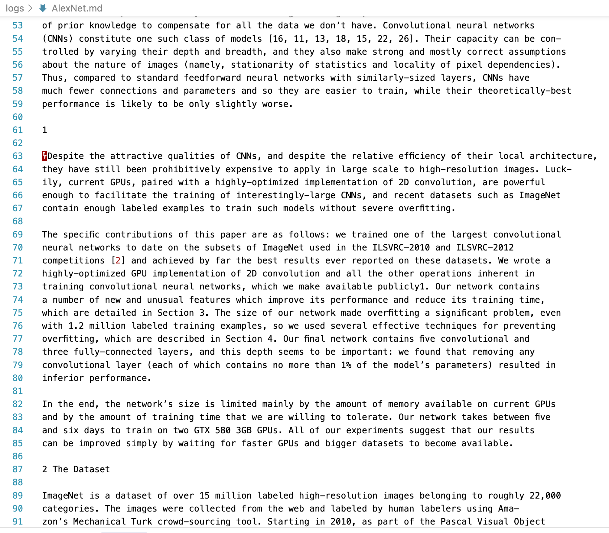

# The Problem: My Workflow Pain

  

    <ul class="text-xl space-y-4">
      <li>• I use <strong class="text-blue-500">Cursor</strong> for assignments.</li>
      <li>• But Cursor <strong class="text-red-500">can't read PDFs</strong>.</li>
      <li class="pl-6">My workflow: PDF → Markdown → Cursor</li>
      <li>• Standard converters produce <strong class="text-red-500">garbled, broken text</strong>.</li>
      <li>• Result: Hours of painful manual cleanup.</li>
    </ul>
  

  

    

      
      ❌
      
    

    
Cursor can't read PDFs directly

    
    
Traditional converters are ineffective

  

 
