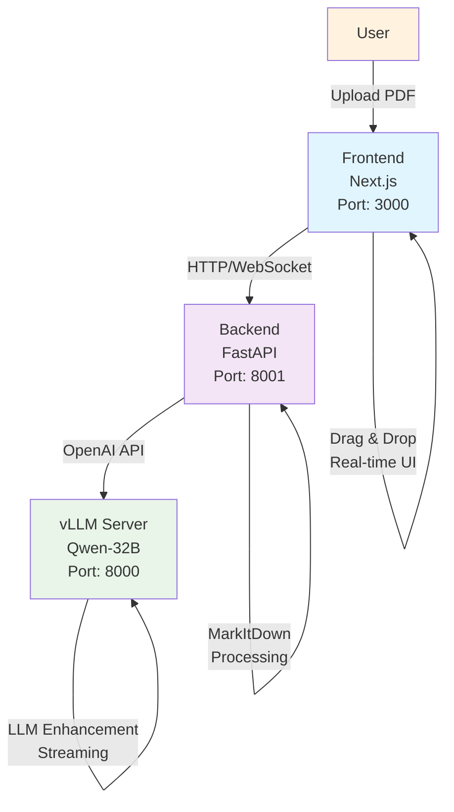

# 🏗️ System Architecture Overview

  

    <h3 class="text-lg font-semibold mb-2">🎨 Frontend</h3>
    
React • TypeScript • TailwindCSS

  

  
  

    <h3 class="text-lg font-semibold mb-2">⚡ Backend</h3>
    
FastAPI • Async • Streaming

  

  
  

    <h3 class="text-lg font-semibold mb-2">🤖 AI Layer</h3>
    
vLLM • GPU Optimized

  

 