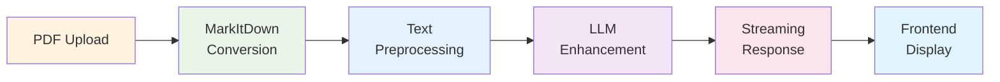

# ⚡ Backend Architecture

## Technology Stack

  

    <h3 class="text-xl font-semibold mb-4">🛠️ Core Technologies</h3>
    <ul class="space-y-3">
      <li class="flex items-center space-x-3">
        
        <strong>FastAPI</strong> - High-performance async API
      </li>
      <li class="flex items-center space-x-3">
        
        <strong>MarkItDown</strong> - Initial PDF conversion
      </li>
      <li class="flex items-center space-x-3">
        
        <strong>Streaming</strong> - Real-time response support
      </li>
      <li class="flex items-center space-x-3">
        
        <strong>Health Monitoring</strong> - System status tracking
      </li>
    </ul>
  

  

    <h3 class="text-xl font-semibold mb-4">🔧 Core Services</h3>
    <ul class="space-y-3">
      <li class="flex items-center space-x-3">
        🔄
        PDF processing pipeline
      </li>
      <li class="flex items-center space-x-3">
        🤖
        LLM integration & prompt engineering
      </li>
      <li class="flex items-center space-x-3">
        ⚡
        Real-time streaming coordination
      </li>
      <li class="flex items-center space-x-3">
        📊
        System health monitoring
      </li>
    </ul>
  

## Processing Pipeline

  <h4 class="font-semibold">🎯 Performance Optimizations</h4>
  
Async processing, streaming responses, and efficient memory management for large documents

 