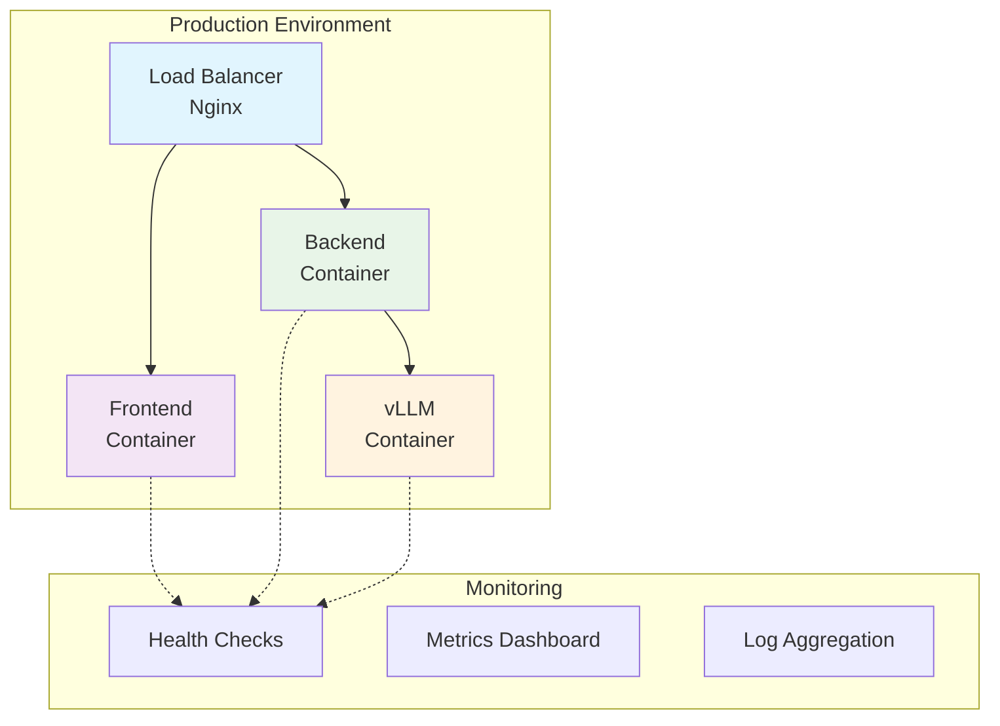

# 🚀 Deployment & DevOps

## Containerization Strategy

  

    <h3 class="text-xl font-semibold mb-4">🐳 Docker & Compose</h3>
    <ul class="space-y-3">
      <li class="flex items-center space-x-3">
        📦
        Multi-container orchestration
      </li>
      <li class="flex items-center space-x-3">
        🔄
        Environment consistency
      </li>
      <li class="flex items-center space-x-3">
        ⚡
        Easy deployment & scaling
      </li>
      <li class="flex items-center space-x-3">
        🛡️
        Isolated service environments
      </li>
    </ul>
  

  

    <h3 class="text-xl font-semibold mb-4">🏭 Production Ready</h3>
    <ul class="space-y-3">
      <li class="flex items-center space-x-3">
        🔐
        SSL/HTTPS encryption
      </li>
      <li class="flex items-center space-x-3">
        🌐
        Nginx reverse proxy
      </li>
      <li class="flex items-center space-x-3">
        ❤️
        Health check monitoring
      </li>
      <li class="flex items-center space-x-3">
        📈
        Performance metrics
      </li>
    </ul>
  

## Architecture Benefits

  

    <h4 class="font-semibold mb-2">🔄 Scalability</h4>
    
Microservices architecture enables horizontal scaling

  

  
  

    <h4 class="font-semibold mb-2">📊 Monitoring</h4>
    
Real-time system health and performance tracking

  

  
  

    <h4 class="font-semibold mb-2">🛡️ Reliability</h4>
    
Fault tolerance and automated recovery

  

 